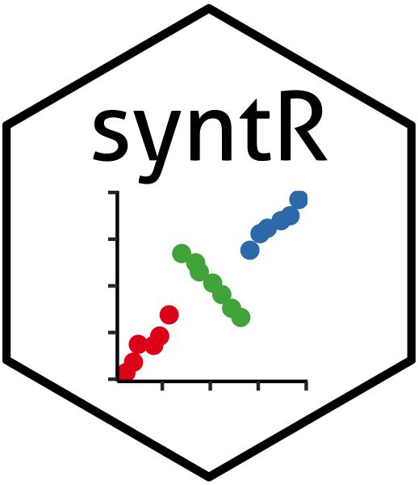

<!-- README.md is generated from README.Rmd. Please edit that file -->

```{r, echo = FALSE}
knitr::opts_chunk$set(
  collapse = TRUE,
  comment = "#>",
  fig.path = "README-"
)
```

# syntR 

syntR is an R package for the reproducible detection and classification of synteny blocks via comparison of two genetic maps. 

## Installation

You can install syntR from github with:

```{r gh-installation, eval = FALSE}
# install.packages("devtools")
devtools::install_github("ksamuk/syntR")
```

## Example

This is a basic example which shows you how to solve a common problem:

```{r example}
## basic example code
```
